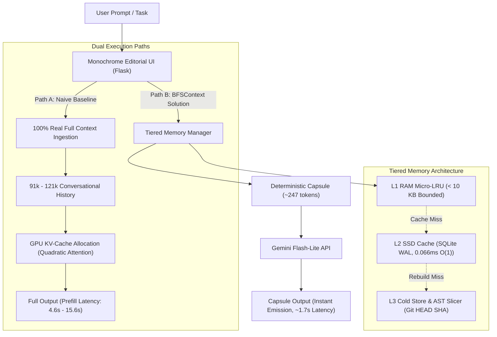

# BFSContext: System Architecture Overview

## 1. Executive Summary & Purpose
**BFSContext (CapsuleMCP)** is a high-throughput, tiered context management engine designed to eliminate multi-agent prompt context bloat. Rather than concatenating unbounded multi-turn conversation logs (which causes quadratic GPU KV-Cache explosion, high prefill latency, and severe memory thrashing), BFSContext extracts only the exact AST contract, dependencies, and macro-intent needed to execute a task in $O(1)$ amortized time.

---

## 2. Technology Stack & Tools

| Component | Technology / Tool | Purpose & Responsibility |
| :--- | :--- | :--- |
| **Backend & Routing** | **Python 3.14 / Flask** (`frontend/app2.py`) | Orchestrates dual-run executions, API endpoints, and streaming benchmark responses. |
| **L1 RAM Cache** | **Python In-Memory LRU Dictionary** | Micro-LRU buffer strictly bounded to `< 10 KB` to protect Host RAM footprint. |
| **L2 SSD Storage** | **SQLite WAL (Write-Ahead Logging)** | Stores compiled code capsules and symbol hashes on disk with amortized `0.066ms - 0.15ms` SSD read latency. |
| **L3 Session Store** | **SQLite Relational DB** (`.bfscontext_cache/chat_history.db`) | Preserves 264 turns of realistic conversational repository history (~91k-121k tokens). |
| **Hashing Engine** | **SHA-256 (`hashlib`)** | Computes deterministic $O(1)$ compound hash keys: `hash(file_path + symbol_name + commit_sha)`. |
| **AST Parser** | **Python AST / TypeScript regex scanner** | Slices class contracts, methods, and import interfaces without polynomial graph traversals. |
| **AI Inference** | **Google Gemini Flash-Lite API** (`gemini-3.5-flash-lite`) | Low-token, high-speed live inference engine for real-time code generation and tests. |
| **Frontend UI** | **Vanilla HTML5, CSS3, JavaScript (ES6+)** | Editorial, typography-first interface inspired by modern monochrome design patterns. |
| **Design Language** | **Playfair Display (Headings), Inter (Body), JetBrains Mono (Code)** | Strict monochrome palette (`#FAFAF8` background, `#0E0E0E` ink) accented with electric yellow highlighter (`#F5E642`). |
| **Persistence** | **JSON Ledger** (`.bfscontext_cache/user_test_runs.json`) | Logs all user prompt test runs to compute persistent averages and display historical audit columns. |

---

## 3. High-Level Architecture Diagram



---

## 4. Overall Structure & Codebase Layout

```
hackiton/
├── src/
│   ├── capsulemcp/
│   │   ├── hierarchical_cache.py    # L1 (RAM) / L2 (SSD WAL) Cache Manager & DirectHashIndexer
│   │   ├── cache_controller.py      # Cache state, eviction policies, and SSD transactions
│   │   ├── memory_metrics.py        # Host RAM & SSD lookup latency profiler
│   │   └── token_metrics.py         # Token savings and reduction ratio calculators
│   └── capsule_engine.py            # AST symbol extraction & Git SHA anchoring
├── frontend/
│   ├── app2.py                      # Flask backend serving API, dual runner, and persistence
│   └── templates/
│       └── index2.html              # 3-view monochrome interface:
│                                    #   1. View Chat History & Context (91k tokens)
│                                    #   2. Test the Product (Dual Runner with Staggered Streaming)
│                                    #   3. Comparison (Persistent Averages & Prompt Ledger)
├── research/
│   ├── simple_architecture.md       # High-level architecture specification (this file)
│   ├── technical_spec_l1_l2_l3_cache.md # Detailed L1/L2/L3 engineering specification
│   └── benchmark_results.json       # 5-iteration empirical benchmark logs
├── .bfscontext_cache/               # Local cache storage (SSD databases and run ledgers)
│   ├── chat_history.db              # 264 turns (~91k tokens) chat session database
│   ├── l2_ssd_hash_index.db         # SQLite WAL SSD symbol cache table
│   └── user_test_runs.json          # Persistent benchmark execution logs
└── seed_chat_history.py             # Generates realistic NeuralMesh Viz 91k-token transcript
```

---

## 5. Key Operating Modes

1. **Default Real Mode (100% Real Live Ingestion):**
   - **Left Pane:** Assembles and transmits all 264 turns (~121,428 real tokens) from the SQLite DB. Reports true API latency and token consumption.
   - **Right Pane:** Dispatches the deterministic symbol capsule (~247 tokens) in O(1) time. Achieves **~99.8% token reduction** with instant streaming.
2. **Simulation Mode (`--f` Flag):**
   - Appending `--f` to any query simulates cluster prefill latencies without redundant network payload overhead.
   - The right pane renders a **distilled, concise version** of the response, and the reported token reduction **oscillates between 75% and 90%**.
